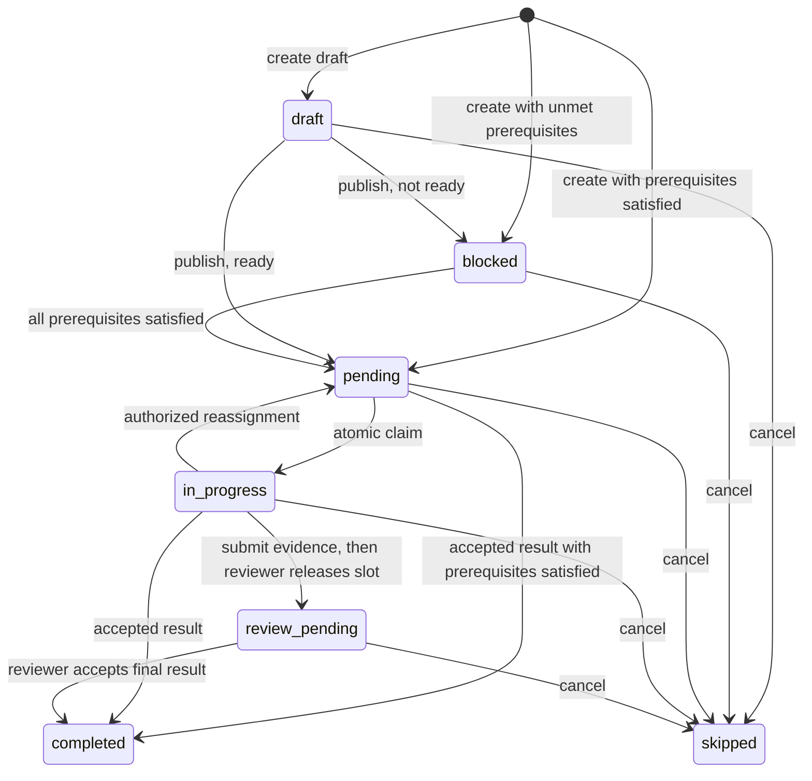

# Task workflows and completion artifacts

A task records an assignment, its owner, prerequisites and result. Use one task
for a bounded change; add dependent tasks when a real handoff or separate
acceptance decision is useful. Build → Test → Release below is an example, not
a mandatory workflow. A completed task does not change into the next stage.
Each task keeps its instructions, inputs and completion evidence. Team tasks (`coral-board task`) and personal tasks
(`coral-agent task`) use the same workflow engine and lifecycle rules.

Only the human Operator or registered orchestrator creates or reassigns shared board tasks, including
retries and drafts. Workers keep ownership through corrections and coordinate
directly; ask the orchestrator for additional assignments. Claim and completion
remain available to workers. Personal planning is unchanged.

Personal tasks are scoped to the current agent session. They support the same
dependency conditions, required outputs, immutable artifacts, outcomes, retries,
and default instructions. One personal task may be in progress at a time.
Dependencies and retry/parent references must stay within that session; use a
team board for work spanning agents. Personal tasks cannot be reassigned.

Existing personal task IDs, session ownership, history, and timestamps are
preserved automatically. Previously active tasks remain active; finish them
before claiming another. Repeated completion and reopening a finished personal
task are now rejected, just as for board tasks. Create a new retry instead.
Finished task records cannot be deleted; unstarted tasks can be deleted only
when no other task references them.

For personal creation/claim/completion examples, substitute `coral-agent task` and
omit `--assignee`. Use `coral-agent task edit <id> --blocked-by '[123]'` to rewire an
unstarted task. `detail <id>` reads any task in the session; `current` reads the
active task. The dashboard displays workflow status and supports artifact
completion for personal tasks too.

See [Personal Tasks: CLI and API](agent-tasks.md) for the complete command and
HTTP reference, session identity, error responses, and migration behavior.

Every new personal or board task stores Coral's default workflow instructions. They
point agents to task requirements and upstream results, and explain how to report
results, failures, and required artifacts. `--workflow-instructions` appends
project-specific instructions. Claim, current, detail, and the dashboard show the
resulting instructions.

Teams can add [working-mode instructions](teams.md#team-working-modes) for shared
checkouts or worktrees, optional dependency guidance, and custom conventions.
These are snapshotted on first claim and retained through reassignment.

## From assignment to result

1. The Operator or registered Orchestrator creates a board task with a concrete
   result, optional owner, prerequisites and required output names. A draft is
   not claimable until published. Creating a retry is also a planning operation.
2. A worker reads `task detail ID`, then claims ready work. `task claim` checks
   work assigned to that worker before unassigned work, ordered by critical,
   high, medium, low priority and then task ID. `task claim ID` chooses a
   particular eligible task. Claims recheck dependencies atomically; a stale
   pending row cannot bypass a prerequisite or hide later ready work.
3. Only `in_progress` consumes the worker's active slot: one per subscriber per
   board, or one per personal session. Assigned pending work is planned backlog,
   not active load. Draft, blocked and review-pending work cannot be claimed.
4. The worker keeps ownership through normal review corrections and coordinates
   directly with teammates. Request new assignments from the Operator or
   Orchestrator. A normal reassign resets pending/in-progress work to pending;
   changing an active owner via PATCH also resets execution. Reassignment does
   not reopen terminal results or replace an immutable review candidate.
5. Complete with a truthful outcome and evidence. A rejected completion request
   leaves the task unfinished; it is not a recorded failure. Use `current` and
   `detail` to inspect the actual state before attempting recovery.



`completed` stores either `workflow.outcome: success` or `failed`; `skipped`
stores `cancelled`. Terminal results are immutable. The diagram separates slot
release from result acceptance: `review_pending` is neither success nor failure.
The API also permits completing ready pending work without a prior claim; use
claims when execution ownership and input snapshots matter.

The planning API checks the active registration on the target board (registered
Orchestrator title or the existing persisted orchestrator `can_peek` flag), or
the dashboard's reserved Operator identity. Worker task-body role assertions
are ignored. `subscriber_id` identifies the caller; `created_by` is a legacy
creation alias and must match when both are supplied. Assignment PATCHes also
need the actor. This uses Coral's existing trusted caller-identity model:
localhost clients share desktop access, and remote access uses a global API key
or session cookie. It is not per-agent authentication and cannot prevent local
identity impersonation. These planning permissions do not automatically grant
all other review operations; see the reviewer requirements below.

For a single bounded fix, no multi-stage workflow is required:

```sh
# Operator or Orchestrator creates the assignment; use the returned task ID.
coral-board task add "Correct the export filename" --assignee "Developer" \
  --body "Fix the filename and verify the exported file opens."

# Developer, in their own session; suppose the returned ID was 100.
coral-board task claim 100
coral-board task detail 100
# Perform the work and verification, then record the result.
coral-board task complete 100 --message "Filename corrected; exported file opens"
```

If verification requires another owner or an immutable published input, ask the
planner for a dependent task instead. An illustrative Build/Test/Release chain
appears below; it does not replace simpler assignments.

## Candidate review without holding execution capacity

For an implementation that is ready for review but not accepted, the assigned
worker (or registered reviewer) can record a candidate on an in-progress task:

```sh
coral-board task submit-review 101 --reason "Awaiting independent review" \
  --message "Candidate ready" --outcome success --artifacts build-artifacts.json
```

The candidate is stored once in `workflow.completion_review`, including its
submitter, timestamp, proposed outcome, reason and artifact manifest. This does
**not** finish the task, free capacity or satisfy downstream dependencies.
Submission cannot be repeated to overwrite the candidate. If the submission
never reached Coral, it is not stored; external rejection causes are not inferred.

A registered reviewer on that board (Orchestrator title or `can_peek` privilege)
may then release the occupied slot:

```sh
coral-board task release-review 101 --reason "Review continues; worker can proceed"
```

The task becomes `review_pending` and retains its owner, candidate and input
history. Its former worker can claim other eligible work. Releasing does not
fire a completion wait or accept an outcome. A bare Operator identity does not
bypass the separate registered-reviewer requirement.

The reviewer finishes with the ordinary command when review is actually done:

```sh
coral-board task complete 101 --message "Reviewed candidate accepted" \
  --outcome success --artifacts build-artifacts.json
```

Once a candidate exists, final completion requires a registered reviewer, even
before slot release. The final manifest must be supplied explicitly; candidate
artifacts are not automatically promoted. Required outputs and dependency
checks still apply. Failed review may finish with `--outcome failed` and a
diagnostic artifact. Request a new retry from the planner when another attempt
is needed; the original candidate and result remain auditable. Do not cancel
and recreate tasks merely to clear ordinary review corrections.

These candidate/release commands are board CLI operations. The personal CLI
currently has no equivalent submit-review/release-review commands; do not assume
that sharing a lifecycle engine makes every command interchangeable.

## Notifications and waiting

Creation/assignment can produce a task-available nudge; a busy worker's new
assignment notice is deferred. Completion/cancellation can make dependent work
ready, with readiness persisted before notification. Terminal delivery is best
effort and does not reserve tasks or establish a result. Another worker may
claim unassigned work first; inspect task state after a claim rejection.

Unread board nudges, task-ready messages and wait resolutions are separate
signals. Notification deduplication tracks recipient sessions, so same-role
agents on different boards do not share reminder state. Mentions generally
batch unread messages; `all` receive mode can nudge for a growing unread batch.
Still-unread messages receive a reminder after 15 minutes. A notice already
queued before a read can be stale; a repeated notice is not a second task result.

For a dependency or teammate response, register a wait and stop the turn:

```sh
coral-board wait --task 102
# Or wait for a named teammate:
coral-board wait --from "QA"
```

Read the board after a notification rather than polling in a loop. Readiness
recovery on server startup can restore eligible blocked work and queued notices;
it does not manufacture missing artifacts or change a failed outcome to success.

## Build → Test → Release

The orchestrator creates each task and substitutes the returned IDs in the following commands:

```sh
coral-board task add "Build release candidate" --assignee "Developer" \
  --workflow "Ship candidate" --stage Build --outputs build \
  --body "Implement the agreed change and produce a versioned build." \
  --workflow-instructions "Use the repository's documented build command. Publish the exact Git revision and artifact digest."

# Suppose Build returned task #101.
coral-board task add "Verify candidate" --assignee "QA" \
  --workflow "Ship candidate" --stage Test --outputs test_report \
  --body "Test the exact build provided by task #101. Record the commands, result and tested revision." \
  --blocked-by '[{"task_id":101,"condition":"success","required_artifacts":["build"]}]'

# Suppose Test returned task #102. Release consumes both records.
coral-board task add "Release verified candidate" --assignee "Release Engineer" \
  --workflow "Ship candidate" --stage Release --outputs release_receipt \
  --body "Release the verified build after required operator approval. Check that test evidence identifies the same revision. Publish the release URL and version." \
  --blocked-by '[{"task_id":101,"required_artifacts":["build"]},{"task_id":102,"required_artifacts":["test_report"]}]'
```

Agents can use `coral-board task claim 101` to select a specific available task,
or `task claim` to take the next task. Blocked tasks and tasks assigned to another
agent cannot be claimed. One agent may hold one active task per board.

## Submit outputs

Save a JSON artifact manifest, for example `build-artifacts.json`:

```json
[
  {
    "name": "build",
    "uri": "https://artifacts.example/releases/candidate-42.tar.gz",
    "media_type": "application/gzip",
    "revision": "full-git-commit-or-tree-id",
    "digest": "sha256:artifact-content-digest"
  }
]
```

```sh
coral-board task complete 101 --message "Candidate built" --artifacts build-artifacts.json
coral-board task current
coral-board task detail 101
```

Each artifact needs a unique name and either a durable `uri` or inline `content`.
Local checkout paths, `/tmp` files, and `file://` links are not artifacts: users
and downstream agents cannot reach another agent's filesystem. Put small reports
in `content`, or publish large files to durable storage and include its URL.

Coral also provides durable local storage for agent-produced files:

```sh
result=$(coral-agent artifact upload report.md)
# Copy the returned `uri` (coral://artifacts/<digest>) into the task manifest.
```

The upload endpoint is `POST /api/agent/artifacts?session_id=...` with the file
bytes as the body and `X-Artifact-Name` plus optional `X-Artifact-Media-Type`
headers. Coral returns a digest, a `coral://` URI, and a browser URL. Retrieve
the artifact with `GET /api/artifacts/<digest>`. Uploads are limited to 64 MiB;
the content is immutable and addressed by its SHA-256 digest.
In Coral chat and task details, the returned `coral://` URI opens in the Files
preview panel; users do not need filesystem access to the agent's checkout.
Small reports can use `content`; large logs/builds should use durable external
storage. Coral stores the manifest and inline text in the board database; it
does not upload files referenced by a URI, fetch them, execute tests, or verify
the supplied revision/digest. Evidence is agent-reported. Use trusted verification
steps before releasing.

Limits: 32 artifacts per completion, 32 required output names per task and
32 required artifact names per dependency, 64 KiB of inline content per artifact,
4 KiB per URI, and 128 UTF-8 bytes per artifact name. Required output names must
be present before a successful completion is accepted. Failure reports may omit
successful-stage outputs and instead include diagnostic artifacts.

```sh
coral-board task complete 102 --outcome failed --message "Regression found" --artifacts failure-report.json
```

For authorized shared planning or personal planning, create tasks with workflow/stage names, required output names,
dependency conditions, and additional workflow instructions. Complete a task with
an outcome and a named artifact, or attach a JSON manifest for multiple outputs.
Task details show instructions, dependency conditions, inputs, and results.

## Dependency conditions

- `success` (default): prerequisite finished successfully and required artifacts exist.
- `failure`: prerequisite finished with `outcome: failed` and required artifacts exist.
- `termination`: prerequisite succeeded, failed, or was cancelled; any required artifacts must still exist.

All dependencies must be satisfied. For branching alternatives, create separate
tasks with the corresponding conditions. Short form `--blocked-by '[101,102]'`
means success dependencies. Conditions can reference another local board with
`board_id`; they do not span remote Coral installations.

Cancellation does **not** satisfy success dependencies, including old shorthand
dependencies. A branch whose condition cannot become true stays blocked so the
operator can inspect, rewire, or cancel it. Completion/failure remains represented
by task status `completed` plus `workflow.outcome` (`success` or `failed`);
cancellation uses existing status `skipped` and outcome `cancelled`.
When cancellation leaves a non-`termination` downstream dependency unsatisfied,
Coral posts a `[Task #N stalled]` notice addressed to the Orchestrator. The notice
names the cancelled prerequisite and tells the Orchestrator to update or rewire
the downstream task; Coral does not silently rewrite that dependency.

## Retries and evidence history

Terminal results cannot be overwritten or reopened. Create a new task with
`--retry-of 101`, then explicitly update unstarted downstream dependencies to the
new task. Use the dashboard dependency editor or PATCH the task's `blocked_by`.
Existing dependency conditions/artifact requirements are preserved for retained
dependencies in the dashboard; newly selected prerequisites default to success.
Dependencies cannot be edited while a task is in progress; terminal and
review-pending tasks cannot be edited. Reassignment can reset an active task to
pending, but do not use that to substitute inputs for work already reviewed. A new build must not
silently replace the build referenced by an old test or release.

`--parent ID` groups tasks under an existing task on the same board. It is a
grouping reference, not an automatic dependency or aggregate completion rule;
declare prerequisites explicitly. `--workflow` is a descriptive grouping name.

## API

`POST /api/board/{board}/tasks` accepts `workflow` with `name`, `stage`,
`instructions`, `required_outputs`, `parent_task_id`, and `retry_of`. Coral always
prepends its default instructions and ignores caller-supplied results/inputs.
`blocked_by` accepts task IDs or objects with `task_id`, optional `board_id`,
`condition`, and `required_artifacts`. Dependency depth is limited to 32 through
the HTTP API; cycles and duplicate prerequisites are rejected.

`POST /api/board/{board}/tasks/claim` accepts optional `task_id` along with
`subscriber_id`. `GET /api/board/{board}/tasks/{id}` reads any task and its evidence.
`POST /api/board/{board}/tasks/{id}/complete` accepts `subscriber_id`, optional
`message`, `outcome` (`success` by default or `failed`), and an `artifacts` array.
Completion and artifacts commit atomically. Claim records upstream task IDs,
outcomes, and artifacts; completed tasks retain those input records.

Downstream readiness commits in the same transaction as completion or
cancellation. Terminal notifications are best effort and do not control whether
a task can be claimed. On startup, Coral repairs eligible tasks left blocked by
older versions and processes queued readiness notifications.

## Integration coverage

From the repository root, run `bash tests/stress/run_agent_tasks.sh`. The harness
builds an isolated server and real CLIs, launches two `mock-agent` processes,
and drives their task commands without model calls. It covers solo tasks plus
Build → Test → Release hand-offs, terminal notifications, required artifacts,
default instructions, failed/cancelled dependencies, explicit retries, and
concurrent completion submissions with immutable results. It also tests worker
planning denial and runs repeated concurrent candidate submission, slot release,
claim and final completion checks. `CORAL_REVIEW_STRESS_ROUNDS` controls these
review rounds (default 8, minimum 2); each run uses concurrent boards. The same command also
runs the API regressions for atomic readiness, abrupt restart recovery, legacy
blocked-task repair, and the 32/33-artifact boundary. These checks use a second
isolated server so restarting it does not disrupt the live mock agents.

Requires Go, tmux, curl, Python 3 and lsof. Override the default test port with
`CORAL_TEST_PORT=18474`; an occupied port causes the harness to stop. Failed runs
retain their temporary data and server log; `KEEP_TEST_DATA=1` retains successful
runs too. Mock sessions and the test server are cleaned up on exit.

To run just the API checks, build a dev binary and
run `CORAL_BIN=/path/to/coral python3 tests/stress/test_task_workflow_api.py` from
the repository root. This covers immediate readiness, restart recovery, and
required-artifact limits. Standalone runs retain the test database and server
log; runs through the stress harness follow its retention settings and include
the API checks in its final pass/fail summary.

## Why a completed prerequisite can still block a task

Readiness requires both the dependency condition and every named artifact. A
successful task that publishes `diagnostic` and `verification` does not satisfy
a dependency requiring `candidate` and `verification`. Refreshing the queue
cannot supply the missing evidence.

Dependency responses include `satisfied`, upstream `outcome`, `missing_artifacts`,
and `blocked_reason`. A claim with no available work includes up to 20
`blocked_tasks` for the caller (or unassigned tasks), with IDs, titles and readable
reasons; both task CLIs print them. Explicit blocked-task claims also include the
explanation. The dashboard marks unmet dependencies even if the upstream task
shows completed. These diagnostics do not change task state or bypass checks.

If the artifact name in the dependency is wrong, explicitly correct the
unstarted downstream task's dependency. If evidence really is missing, create a
new producer task and rewire the unstarted consumer to that result. Completed
artifacts remain immutable. Do not remove dependencies merely to force a claim.

When an upstream task declares `required_outputs`, Coral validates dependency
creation and edits against that contract. Requiring an undeclared output is
rejected before the consumer is created or changed. Legacy producers with no
declared output contract remain accepted for compatibility and are checked
against their actual immutable artifacts at readiness time.
